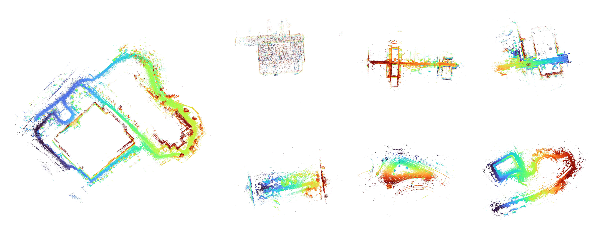

# Lightning-LM



3D LiDAR mapping and localization for **Deep Robotics M20 Pro** and **Livox Mid360**.
Build maps with loop closure, view reconstruction live, and localize against saved
point clouds. Both sensor presets use the same four online and offline applications.

## 1. Install and build

Supports **Ubuntu 20.04 / ROS 2 Foxy** and **Ubuntu 22.04 / ROS 2 Humble**.
Use an OpenGL desktop for visualization. For an M20 Pro without internet access,
follow [onboard deployment](#5-deploy-from-a-laptop-to-the-robot).
For a Jetson AGX using Livox LiDAR and its internal IMU, follow
[Lite3 EDU with AGX setup](#62-lite3-edu-with-agx-mid360).
Run these commands from the repository root in a fresh Bash terminal:

```bash
source /opt/ros/humble/setup.bash
bash scripts/install_dep.sh
bash scripts/build.sh
source scripts/setup.bash
```

On Ubuntu 20.04, use `source /opt/ros/foxy/setup.bash` in the first line.
Run `source scripts/setup.bash` from the repository root in every new application
or bag-playback terminal.

<details>
<summary>1.1 Platform and build details</summary>

| Platform | ROS distribution |
|---|---|
| Ubuntu 20.04 | Foxy |
| Ubuntu 22.04 | Humble |

The native ROS pairings are [Humble with Ubuntu 22.04](https://docs.ros.org/en/humble/Installation/Ubuntu-Install-Debs.html)
and [Foxy with Ubuntu 20.04](https://docs.ros.org/en/foxy/Installation/Ubuntu-Install-Debians.html).
The scripts select dependencies from the sourced ROS distribution and load the
same distribution at runtime. Use a separate build/checkout when switching ROS
versions to keep generated interfaces and libraries consistent.

The installer uses `sudo apt-get` for missing dependencies. The build uses all
CPUs, builds the bundled Pangolin source into `.deps`, and installs the ROS package
locally. On a workstation with limited RAM, reduce the job count:

```bash
CMAKE_BUILD_PARALLEL_LEVEL=2 bash scripts/build.sh
```

Keep the generated build directories and rerun `bash scripts/build.sh` after
editing the code. The installer includes `ccache`, which the build script uses
automatically to reuse previous compilations. Run `ccache -s` to see cache usage.

The default Release build omits debug symbols. To include them for debugging:

```bash
CMAKE_BUILD_TYPE=RelWithDebInfo bash scripts/build.sh
```

A clean source build was checked; a fresh operating-system installation was not.
For headless operation, set `system.with_ui: false` in the selected configuration.

</details>

## 2. Select a sensor and recording

| Sensor system | Configuration | LiDAR input | IMU input |
|---|---|---|---|
| M20 Pro | `config/m20_pro.yaml` | `/LIDAR/POINTS` · `sensor_msgs/msg/PointCloud2` | `/IMU` |
| Mid360 | `config/mid360.yaml` | `/livox/lidar` · `livox_ros_driver2/msg/CustomMsg` | `/livox/imu` |

Use the same preset for mapping and localization. Set paths for your recording
and a **new** map directory; `BAG` accepts a SQLite bag directory or `.db3` file:

```bash
export CONFIG="$PWD/config/mid360.yaml"
export BAG="/absolute/path/to/recording"
export MAP="$PWD/data/my_map"
```

For M20 Pro, select `config/m20_pro.yaml`. Check the topic names and sensor
calibration when using another mounting.

<details>
<summary>2.1 Timestamps, calibration, and 3D estimation</summary>

LiDAR and IMU messages may arrive asynchronously and at different rates. Their
timestamps must use a consistent time base: odometry waits for IMU coverage
through each scan's end and uses per-point times to compensate motion. Exact
message pairing or simultaneous arrival is unnecessary. The code does not
estimate sensor clock offsets; correct offsets or drift in the driver/time source.
Hardware clock synchronization is one way to satisfy this requirement, not an
extra trigger mechanism required by the application. Bag playback's `--clock`
does not repair incorrect sensor timestamps.

M20 points require `x`, `y`, `z`, `intensity`, and absolute per-point `timestamp`
in seconds, on the same time base as the scan header. Mid360 uses `offset_time`
in nanoseconds relative to the scan header. IMU units are radians/second and
metres/second².

Extrinsics transform LiDAR points into the IMU frame:
`p_imu = extrinsic_R * p_lidar + extrinsic_T`. The supplied translations are
`[0, 0, 0]` for M20 Pro and `[0, 0, 0.28]` for the tested Mid360 mounting.
The Mid360 value is mounting-specific; calibrate it for your installation.

M20 uses inertial motion prediction. Mid360 uses constant-velocity translation
with gyro rotation. Both estimate full 3D motion, use 0.5 m scan/map voxels, and
disable fixed-height and 2D pose constraints. See the
[implementation notes](doc/implementation.md) for the model and timing details.

</details>

## 3. Map a recording

### 3.1 Offline mapping

```bash
ros2 run lightning run_slam_offline \
  --config "$CONFIG" --input_bag "$BAG" --map_path "$MAP"
```

The viewer opens during processing. At the end, the application saves the map,
prints `map saved`, and closes the viewer.

### 3.2 Online mapping

Start the node before bag playback:

```bash
ros2 run lightning run_slam_online --config "$CONFIG"
```

In another sourced terminal, set `BAG` and replay the recording:

```bash
ros2 bag play "$BAG" --rate 1.0
```

When mapping is finished, call this service from another sourced terminal:

```bash
ros2 service call /lightning/save_map lightning/srv/SaveMap "{map_id: online_map}"
```

Wait for `response: 0`, then press **Ctrl+C** in the mapping terminal. The map is
saved to `data/online_map/` relative to that terminal's working directory.
Choose a new `map_id` for each run. Online mapping requires this explicit save.
For live sensor input, follow [onboard mapping](#7-onboard-mapping).

<details>
<summary>3.3 Map files and viewer controls</summary>

Keep the complete map directory: `global.pcd` is the full point cloud;
`index.txt` and numbered `.pcd` tiles are also required for localization.
Nonempty output directories are protected from overwriting. To localize against
the online map, set `MAP="$PWD/data/online_map"` in the localization terminal.

Use the mouse to rotate, pan, and zoom; enable **Follow** to track the robot.
Long routes can extend beyond the initial view. If the viewer is blank, check
that sensor data is arriving, then adjust the camera. Run from an OpenGL desktop
with `DISPLAY` set; setup selects Pangolin's X11 backend, including through XWayland.

For the saved-map viewer below, `-ps 2` sets the point size. Press **h** in the
PCL window for its controls. `pcl-tools` is installed by the dependency script;
see the [PCL viewer reference](https://pointclouds.org/documentation/tutorials/walkthrough.html#binaries)
for additional display options. Opening a PCD in this viewer does not modify it.

</details>

### 3.4 View a saved map

After offline mapping finishes:

```bash
pcl_viewer "$MAP/global.pcd" -ps 2
```

After online mapping returns a successful save response:

```bash
pcl_viewer "$PWD/data/online_map/global.pcd" -ps 2
```

Use your chosen map directory or `map_id` if it differs from these examples.

## 4. Localize a recording

### 4.1 Offline localization

```bash
ros2 run lightning run_loc_offline \
  --config "$CONFIG" --input_bag "$BAG" --map_path "$MAP" \
  --trajectory "$PWD/localization.tum"
```

### 4.2 Online localization

```bash
ros2 run lightning run_loc_online \
  --config "$CONFIG" --map_path "$MAP" \
  --trajectory "$PWD/localization_online.tum"
```

Replay the bag from another sourced terminal using the
command in section 3.2. The viewer shows the reference map, scan, and trajectory.
Press **Ctrl+C** after playback to close the viewer and flush the trajectory.
For live sensor input, follow [onboard localization](#8-onboard-localization).

<details>
<summary>4.3 Initialization and pose output</summary>

Initialization starts around the map's saved starting pose. Replaying the mapping
recording needs no manual initial pose. To start elsewhere, publish
`geometry_msgs/msg/PoseWithCovarianceStamped` on `/initialpose` with
`header.frame_id: map`, for example with RViz's **2D Pose Estimate** tool.
This supplies a starting guess; estimation remains 3D.

Online localization publishes `map` → `base_link` on `/tf` and
`geometry_msgs/msg/PoseStamped` on `/lightning/pose`. The optional trajectory
contains valid map matches as `timestamp x y z qx qy qz qw`; an existing trajectory
file is replaced. Localization keeps the reference map unchanged.

Run mapping and localization separately when evaluating their results. Topic
names, extrinsics, and the saved map must match the selected sensor setup.

</details>

## 5. Deploy from a laptop to the robot

Download the repository on your laptop, transfer the sources to the robot
computer, then compile and install there. Use section 5.2 for M20 Pro/AOS or
section 5.3 for Lite3 EDU/AGX. With the standard dependencies installed, the robot
does not need an external internet connection.

### 5.1 Laptop: prepare the source archive

Download this repository using **Code → Download ZIP** and extract it on your
laptop, or use your existing Git checkout. Open a Bash terminal in its root
and create a source archive:

```bash
tar -czf /tmp/lightning-source.tar.gz --exclude='__pycache__' --exclude='*.pyc' \
  CMakeLists.txt package.xml cmake config scripts src srv \
  thirdparty/Pangolin-0.9.3.zip thirdparty/Sophus thirdparty/livox_ros_driver \
  README.md AGENTS.md LICENSE.txt doc
```

### 5.2 M20 Pro (AOS)

Connect the laptop to the robot network. Set `AOS` to the robot's address and
transfer the archive:

```bash
export AOS=10.21.33.103
scp /tmp/lightning-source.tar.gz "user@$AOS:~/"
ssh "user@$AOS"
```

When using the additional network adapter, use `export AOS=10.21.41.1` instead.

In the AOS terminal, extract into a new deployment directory and build:

```bash
mkdir -p ~/lightning-lm
tar -xzf ~/lightning-source.tar.gz --touch -C ~/lightning-lm
cd ~/lightning-lm
source /opt/ros/foxy/setup.bash
bash scripts/build_robot.sh
source scripts/setup.bash
ros2 pkg executables lightning
ros2 interface show lightning/srv/SaveMap
ros2 interface show livox_ros_driver2/msg/CustomMsg
```

The script checks the installed dependencies, compiles the bundled Pangolin and
Lightning-LM sources, and installs them in this deployment directory. It selects
up to four compiler jobs according to available RAM.

Continue with [sensor preparation](#61-m20-pro),
[onboard mapping](#7-onboard-mapping), and
[onboard localization](#8-onboard-localization).

### 5.3 Lite3 EDU with AGX

On the laptop, transfer the source archive from section 5.1 through the robot:

```bash
export JUMP=ysc@192.168.2.1
export AGX=ysc@192.168.1.45
scp -o HostKeyAlias=lightning-agx -J "$JUMP" \
  /tmp/lightning-source.tar.gz "$AGX:~/"
ssh -Y -C -o HostKeyAlias=lightning-agx -J "$JUMP" "$AGX"
```

In the AGX terminal, compile and install:

```bash
mkdir -p ~/lightning-lm
tar -xzf ~/lightning-source.tar.gz --touch -C ~/lightning-lm
cd ~/lightning-lm
source /opt/ros/humble/setup.bash
bash scripts/build_robot.sh
source scripts/setup.bash
ros2 pkg executables lightning
ros2 interface show lightning/srv/SaveMap
ros2 interface show livox_ros_driver2/msg/CustomMsg
```

Continue with [AGX sensor preparation](#62-lite3-edu-with-agx-mid360),
[onboard mapping](#7-onboard-mapping), and
[onboard localization](#8-onboard-localization).

<details>
<summary>5.4 Build settings and subsequent code updates</summary>

On RK3588, the robot build script distributes compiler jobs across the four A76
cores and runs compilation at reduced scheduling priority. It reduces the default
job count when less RAM is available. This is an initial memory estimate; other
software can still consume RAM during the build. Runtime threading is configured
separately.

To check dependencies and see the selected settings without building:

```bash
bash scripts/build_robot.sh --check
```

Keep `build`, `build-pangolin`, `.deps`, and `install` for subsequent builds.
After transferring changed sources, rebuild from the same robot directory:

```bash
bash scripts/build_robot.sh
source scripts/setup.bash
```

Unchanged files are skipped. If `ccache` is installed, it also reuses previous
compilations when their inputs match. To request fewer jobs:

```bash
CMAKE_BUILD_PARALLEL_LEVEL=2 bash scripts/build_robot.sh
```

The source archive works with a downloaded ZIP or Git checkout and includes
local source edits and all bundled source dependencies. Laptop build products
are excluded; the robot produces native ARM binaries. The `--touch` extraction
option gives transferred source files the robot's current modification time. Preserve the
robot's sensor clock synchronization and existing build-product timestamps.

</details>

## 6. Connect to robots and sensor drivers

### 6.1 M20 Pro

On the NOS host, start the point-cloud relay:

```bash
ssh user@10.21.31.106
sudo systemctl start multicast-relay.service
sudo systemctl status multicast-relay.service
```

On a Linux desktop, connect to AOS with X11 forwarding:

```bash
ssh -Y -C user@10.21.33.103
```

When using the additional network adapter configured for `10.21.41.1`, connect
through that address instead:

```bash
ssh -Y -C user@10.21.41.1
```

On Windows, use an SSH client with an X server, such as MobaXterm, and enable
**X11 forwarding** for the SSH session. Lightning-LM does not require a particular
SSH client.

Complete [onboard deployment](#5-deploy-from-a-laptop-to-the-robot), then change
to that repository directory on AOS. Enter a root shell and configure this
deployment **once**:

```bash
cd ~/lightning-lm
sudo env DISPLAY="$DISPLAY" XAUTHORITY="${XAUTHORITY:-$HOME/.Xauthority}" bash
source /opt/robot/scripts/setup_ros2.sh
python3 scripts/onboard.py configure m20
```

Check live LiDAR and IMU delivery:

```bash
python3 scripts/onboard.py status
```

Keep the firmware sensor publishers running. Continue with
[onboard mapping](#7-onboard-mapping) or
[onboard localization](#8-onboard-localization).
In later AOS terminals, enter the same root shell from the deployment directory.
The onboard commands load the saved configuration and ROS settings automatically.

<details>
<summary>6.1.1 Relay and runtime configuration</summary>

To start the relay automatically after reboot, run
`sudo systemctl enable multicast-relay.service` on NOS.

Configuration creates `data/onboard.json` for the deployment settings and
`data/onboard.yaml` for the sensor settings. The M20 runtime copy changes only
`system.with_ui`; its calibration and estimator settings remain the same as
`config/m20_pro.yaml`. Mapping, localization, and RViz all load the saved settings.
The launcher selects A76 core 7 for estimation and core 6 for RViz. Preserve the
robot's sensor clock synchronization when setting up live inputs.

The root-shell command preserves SSH's display and X authorization. Keep the
SSH-assigned `DISPLAY`; do not replace it with the laptop's IP address. RViz2 and
its ROS subscriptions run on AOS, while SSH forwards the window to the laptop.
The map remains onboard. Window size and refresh rate still affect Wi-Fi traffic.

If the window cannot open, check `echo "$DISPLAY"` before entering the root shell
and reconnect with X11 forwarding enabled. The RViz command uses software OpenGL
for forwarded displays. MobaXterm also provides OpenGL settings under
**Settings → Configuration → X11**; see its
[X11 documentation](https://mobaxterm.mobatek.net/documentation.html).

</details>

### 6.2 Lite3 EDU with AGX (Mid360)

Connect through the robot to run Lightning-LM and RViz2 on the AGX, using
the Livox sensor's **internal IMU**. Ubuntu displays the forwarded window
through standard SSH; MobaXterm is optional on Windows.

Complete [AGX deployment](#53-lite3-edu-with-agx) first.

For each AGX application or viewer terminal, open a **new terminal on your laptop's desktop**
and connect directly through the robot with X11 forwarding:

```bash
ssh -Y -C -o HostKeyAlias=lightning-agx -J ysc@192.168.2.1 ysc@192.168.1.45
```

Use this connection for RViz as well. In the new AGX terminal, check:

```bash
echo "$DISPLAY"
```

It should print an SSH-assigned display such as `localhost:10.0`. If it is empty,
reconnect from the laptop with the command above before opening RViz.

In the AGX repository directory, configure this deployment **once**. The same
launcher used for M20 Pro finds the installed full Livox driver workspace:

```bash
cd ~/lightning-lm
python3 scripts/onboard.py configure agx
```

Before live mapping or localization, start the LiDAR driver in a separate AGX
terminal and leave it running:

```bash
cd ~/lightning-lm
python3 scripts/onboard.py lidar
```

The driver supplies **both LiDAR and the internal IMU**. One running driver can
serve successive mapping and localization sessions; you do not restart it for
each algorithm run. Start it again after it stops or the AGX reboots. If both
streams are already arriving, the command reuses the existing driver.

In later AGX application or RViz terminals, change to `~/lightning-lm` and use the
commands below. They load the saved sensor configuration, ROS domain, middleware,
CPU settings, and visualization environment automatically. No repeated exports or
`source` commands are needed. RViz still requires the X11-forwarded SSH connection.

```bash
python3 scripts/onboard.py status
```

Continue with [onboard mapping](#7-onboard-mapping) and
[onboard localization](#8-onboard-localization).

<details>
<summary>6.2.1 Driver setup, network and internal-IMU calibration</summary>

The jump host forwards SSH to the AGX; it does not run Lightning-LM or RViz.
Substitute the SSH accounts and addresses for your setup. `HostKeyAlias` keeps
this AGX's identity separate from a device using the same private IP address on
another network. Verify the host identity when first connecting or when its key
changes. Keep SSH's assigned `DISPLAY` and X authorization.

An empty `DISPLAY` causes Qt's `could not connect to display` error and can also
produce an `xcb` plugin message. Reconnect from the laptop's graphical desktop
with `ssh -Y -C`; sourcing ROS or selecting software OpenGL cannot add X11
forwarding to an existing plain SSH session. Do not manually set `DISPLAY` to
`:0` or to the laptop's address. The direct `-J` command forwards through the
robot without requiring an X server there. On Windows, start the SSH client's
X server and enable X11 forwarding before connecting.

The AGX needs the ROS distribution and dependencies from section 1. Once these
are installed, the source build requires no internet downloads. The robot build
script selects up to four jobs according to available RAM. AGX compilation and
runtime use its available CPUs. The saved AGX profile retains the shell's allowed
CPU set; the M20 profile selects its A76 cores. The onboard launcher is compatible
with the supported Ubuntu 20.04/Foxy and Ubuntu 22.04/Humble installations.

ROS domain 42 and `ROS_LOCALHOST_ONLY=1` keep this pipeline on the AGX. Use the
same settings for every participant; the launcher applies them to the driver,
applications, and viewers. The Livox driver still receives
sensor packets over Ethernet. RViz subscribes locally, while SSH carries window
drawing traffic over Wi-Fi. The software Mesa settings support the forwarded
window on Jetson; window size and refresh rate affect bandwidth.

The application uses `/livox/lidar` and `/livox/imu`. Both the
[Mid360 manual](https://terra-1-g.djicdn.com/851d20f7b9f64838a34cd02351370894/Livox/Livox_Mid-360_User_Manual_EN.pdf)
and the [Mid360s manual, page 22](https://terra-1-g.djicdn.com/65c028cd298f4669a7f0e40e50ba1131/Mid-360S/UM/20260601/Livox_Mid-360s_User_Manual_en.pdf#page=22)
define aligned axes and place the internal IMU at `[0.011, 0.02329, -0.04412]`
metres in LiDAR coordinates. Lightning-LM uses `p_imu = R * p_lidar + T`, so the
runtime translation has the opposite sign. Keep the driver's point-cloud
extrinsic transform at identity when using these values.

The one-time command saves deployment settings in `data/onboard.json` and creates
`data/onboard.yaml` from `config/mid360.yaml`, selecting the internal-IMU transform
and disabling Pangolin. These generated files stay local to the robot. Later
commands load them automatically without modifying shell startup files or saving
SSH's session-specific `DISPLAY`.

The full Livox hardware driver must already be built in its own workspace.
Lightning-LM bundles message definitions, not the hardware driver. Configuration
searches the home directory for one installed workspace with the selected launch
file and remembers its location. If the driver is elsewhere or several workspaces
are installed, select it explicitly:

```bash
python3 scripts/onboard.py configure agx --driver-workspace /path/to/livox_driver_workspace
```

For a Mid360 on another computer, launch the full driver in its own sourced
workspace with the same ROS domain and Fast DDS profile as Lightning-LM. Keep its
existing reliability setting: Lightning-LM's best-effort subscriptions accept
either best-effort or reliable publishers.

The default driver launch is `msg_MID360s_launch.py`. For an original Mid360,
configure with `--driver-model mid360`. The selected full driver and Livox SDK
must support that sensor variant. The launcher sources the full driver workspace
separately from Lightning-LM's message-only package.

Repeating `configure` preserves an existing runtime YAML. To select another
calibration, pass `--config /path/to/calibrated_sensor.yaml`; the launcher copies
it and disables only Pangolin. A robot URDF's LiDAR-to-body mounting is a separate
transform, applied when converting sensor estimates to body coordinates. The
shared recording preset remains unchanged. Both algorithms use the same saved
runtime configuration.

The launcher checks that both sensor streams are arriving before starting live
mapping or localization. Discovery alone is insufficient. `status` reports the
received counts and topic publishers; if a publisher exists but a stream is
missing, inspect its network configuration instead of starting another driver.

</details>

<details>
<summary>6.3 Best-effort DDS and the larger shared-memory buffer</summary>

Best effort avoids waiting for retransmission of missing samples. Adequate
processing capacity and buffering still matter; delivery is not guaranteed.
A reliable Mid360 publisher does **not** need to be changed to best effort.
A best-effort publisher cannot satisfy a reliable subscriber, so both supplied
presets retain `common.sensor_qos: best_effort`.
See the [ROS 2 QoS compatibility rules](https://docs.ros.org/en/humble/Concepts/Intermediate/About-Quality-of-Service-Settings.html#qos-compatibilities).

`scripts/setup.bash` selects Fast DDS and loads `config/fastdds.xml`, increasing
the shared-memory segment to **64 MiB per participant**, with an **8 MiB** maximum
message and **4096** queued descriptors. Some M20 scans approach 4 MiB; Fast DDS
2.6's default 512 KiB segment can be too small for one scan. This expands transport
capacity while preserving best-effort QoS. See the
[Fast DDS buffer documentation](https://fast-dds.docs.eprosima.com/en/2.6.x/fastdds/transport/shared_memory/shared_memory.html).

Apply the profile to the application and publisher, including the bag player.
Restart an existing driver after applying it: outgoing buffers belong to the
publisher. Keep the driver's own workspace sourced; sourcing Lightning-LM's
overlay there can shadow the full `livox_ros_driver2` package with message-only
definitions. Explicit middleware/profile environment overrides are preserved by
setup and must select Fast DDS and this XML to use these settings.

Shared memory applies on the same computer. UDP remains enabled between
computers, where network and socket capacity need separate validation.
If playback falls behind, reduce `--rate`. Larger queues cannot fix sustained
CPU overload.

</details>

## 7. Onboard mapping

Complete your robot's setup in [section 6](#6-connect-to-robots-and-sensor-drivers),
then run from the repository root on AOS or AGX. The commands load the saved
configuration automatically. Keep the robot standing during initialization and
leave the sensor driver running; on AGX, start it with `onboard.py lidar` first.

### 7.1 Start mapping

In the prepared application terminal:

```bash
python3 scripts/onboard.py slam
```

### 7.2 View the location, LiDAR, and trajectory

Open a new terminal **on your laptop's desktop** and use your robot's
`ssh -Y -C` connection command from section 6. In that new AOS or AGX session,
enter the deployment directory (and the root shell on M20). Check that
`echo "$DISPLAY"` prints a value, then open RViz2. The command loads the same
saved settings automatically:

```bash
python3 scripts/onboard.py rviz
```

The window shows the **current LiDAR scan**, a **red location arrow**, and the
**yellow trajectory**. The full map is not displayed. You can open RViz2 after
mapping starts and still see the trajectory recorded since startup.

### 7.3 Save the map

In another terminal on the same robot computer, enter the deployment directory
(and the root shell on M20), then save to a new map directory:

```bash
python3 scripts/onboard.py save onboard_map
```

Wait for `response: 0` before pressing **Ctrl+C** in the mapping terminal.
The map is saved to `data/onboard_map/` relative to the mapping terminal's
repository root. Choose a new `map_id` for each mapping run.

<details>
<summary>7.4 Live view, CPU placement, and saved maps</summary>

Onboard mapping uses the same `run_slam_online` application and selected sensor
preset as online dataset playback. The robot's sensor driver supplies LiDAR and
IMU messages directly; no bag player is needed.

Keep the complete map directory, including `index.txt`, all numbered `.pcd`
tiles, and `global.pcd`. The same map format is used by recorded-data and onboard
localization. The runtime copy disables Pangolin; `--rviz` enables the lightweight
ROS display outputs. Neither the RViz preset nor these outputs includes a map
cloud.

On the standard RK3588 firmware, the commands place estimation on A76 core 7 and
RViz2 on A76 core 6. This avoids the A55 affinity inherited by some SSH shells and
keeps rendering separate from estimation. Compiler job settings do not set runtime
affinity. Section 6 selects these CPU numbers for M20 Pro and retains the
AGX's available CPU set for Lite3 EDU.

The current scan is deskewed and uses the same LiDAR pose and acquisition timestamp
as the arrow. Both update at up to 5 Hz. Only the newest scan is shown; the path
retains the whole session at this sample rate and refreshes at 1 Hz. Opening RViz2
late or reopening it retrieves the retained path while the application is running.
Restarting the application starts a new path. Path memory grows with session length.

Mapping displays the current pose with the latest keyframe correction. Historical
trajectory points keep their estimates from when they were recorded. The view
follows `lightning_lidar`. To inspect the whole route, change **Target Frame** to
`map` and zoom out; rotate and pan with the mouse. RViz's **Frame Rate** is set to 5
to limit remote redraws. Actual rendering can be slower depending on the display
and connection; reduce the setting or shrink the window on a slower connection.

</details>

### 7.5 View a saved map separately

In an X11-forwarded terminal on the robot, open the saved map in RViz2:

```bash
python3 scripts/onboard.py rviz --map data/onboard_map
```

The map loads and renders on the robot; SSH forwards the window to your laptop.
This view works without the driver, mapping, or localization running. Close the
window or press **Ctrl+C in the viewer terminal** to stop RViz and its map publisher.
Maps saved with the onboard commands use
their recorded startup gravity direction to display horizontally. The live
scan/path view in section 7.2
continues to omit map clouds.

<details>
<summary>7.5.1 Saved-map display settings</summary>

Pass a saved map directory or a `.pcd` file. The viewer fits its camera to the
cloud bounds and publishes a retained XYZ cloud in frame `map`. Each viewer has
its own cloud and display-transform topics, so opening another saved map does
not replace an existing view or require the SLAM node to publish TF.

Keep the robot stationary when starting mapping. The launcher records the IMU's
upward direction before initialization and saves it in `map_view.json` alongside
the map. RViz uses that map's reference to rotate the display into a gravity-aligned
frame. The PCD files, localization tiles, estimated poses and sensor calibration
retain their original coordinates. Keep the sidecar with the map; its PCD hash
prevents accidentally applying a reference from another map.

A mounting URDF defines sensor-to-body geometry. It does not by itself make a
map horizontal: its axes must match the driver, and the body can be tilted. Do not
replace the LiDAR-to-internal-IMU calibration with a body mounting rotation.
Leveling uses measured gravity, not a fitted floor plane or a constraint on 3D
estimation. To inspect the original map frame:

```bash
python3 scripts/onboard.py rviz --map data/onboard_map --original-frame
```

Older maps without `map_view.json` use their original frame. If an upward vector
was measured in that map's initial IMU frame, supply it with `--up X Y Z`. Do not
use the robot's current IMU direction for a map recorded at a different attitude.
The saved-map alignment does not change the live scan/path view.
If RViz asks to save display changes when closing, choose **Discard**; this prompt
concerns the temporary viewer configuration, not the map files.
Close the viewer before ending the SSH session.

The display uniformly samples large clouds to at most 500,000 points, keeping
each message below the supplied 8 MiB transport limit. It reports input, finite,
and displayed point counts; the saved files are read without modification. To
reduce rendering load, use a smaller display budget:

```bash
python3 scripts/onboard.py rviz --map data/onboard_map --max-points 100000
```

Map data stays on the robot, but X11 drawing still uses Wi-Fi bandwidth. Rotate,
pan, and zoom in RViz as needed. This is a saved-map view; it does not display the
map as SLAM builds it. Saved maps from recorded-data workflows can be viewed the
same way once their files are on the robot.

</details>

## 8. Onboard localization

Stop mapping first. Run from the repository root on AOS or AGX after the
one-time setup in [section 6](#6-connect-to-robots-and-sensor-drivers). Localization
loads the same saved configuration as mapping. Keep the sensor driver running;
on AGX, use `onboard.py lidar` if it has stopped.

### 8.1 Load the map and start localization

Use the map saved in section 7, or substitute an existing complete map directory:

```bash
python3 scripts/onboard.py localize data/onboard_map
```

### 8.2 View the location, LiDAR, and trajectory

Close the mapping RViz window. Connect a new viewer terminal from your laptop
with `ssh -Y -C` as in section 7.2. Check that `echo "$DISPLAY"` prints a value,
then run from the repository root; the saved settings load automatically:

```bash
python3 scripts/onboard.py rviz
```

The same view shows the current scan, location arrow, and full localization
trajectory. The reference map is used onboard without displaying it in RViz2.

### 8.3 Stop localization

Press **Ctrl+C** in the localization terminal when finished, then close RViz2.
Valid localization poses are written to `data/localization_onboard.tum`; the reference
map is preserved. Stop the Livox driver you launched when finished with both
workflows; leave the robot's firmware sensor and control services running.

<details>
<summary>8.4 Initialization, dataset maps, and pose output</summary>

Onboard localization uses the same `run_loc_online` application and sensor
settings as online dataset playback. Maps from recorded data and live mapping
use the same directory format; keep the complete tiles and use the matching
sensor calibration.

Initialization starts around the map's saved starting pose. Start near that
pose, or provide an initial estimate on `/lightning/initialpose` using
`geometry_msgs/msg/PoseWithCovarianceStamped` with `header.frame_id: map`. The
RViz **2D Pose Estimate** tool is configured for this topic; it supplies a starting
guess and does not constrain subsequent estimation to 2D.

The RViz scan, arrow, and path use accepted scan-to-map matches. Before
initialization succeeds they remain empty; if matching fails they retain the last
valid display until a new match succeeds. Check the localization terminal when
the display stops updating.

M20 Pro firmware already publishes transforms on `/tf`. The launcher remaps
Lightning-LM's `map` → `base_link` transform to `/lightning/tf` and initial-pose
input to `/lightning/initialpose`. Pose output remains on `/lightning/pose`.
The underlying online executable still accepts the same flags for direct use.

The display topics are `/lightning/current_pose`, `/lightning/current_scan`, and
`/lightning/trajectory`, in frame `map`. The separate visualization transform is
`map` → `lightning_lidar` on `/lightning/tf`. Existing `/lightning/pose` output
continues to provide the estimator's higher-frequency pose.

The trajectory file uses `timestamp x y z qx qy qz qw` rows and includes valid map
matches. An existing trajectory file at the selected path is replaced.

</details>

## 9. Results and onboard resources

<details>
<summary>9.1 Seven-dataset reconstruction and localization results</summary>

All seven recordings passed offline/online mapping and offline/online localization
checks on Ubuntu 22.04 / Humble, with the viewer enabled and online playback at 1×.
Each sensor family uses one preset without route-specific tuning.

| Recording | Configuration | Offline mapping | Online mapping | Offline localization | Online localization |
|---|---|---|---|---|---|
| Library F | `m20_pro.yaml` | Pass | Pass | Pass | Pass |
| Office | `m20_pro.yaml` | Pass | Pass | Pass | Pass |
| Building 1 | `mid360.yaml` | Pass | Pass | Pass | Pass |
| Building 2 | `mid360.yaml` | Pass | Pass | Pass | Pass |
| Building 3 | `mid360.yaml` | Pass | Pass | Pass | Pass |
| Grass 2 | `mid360.yaml` | Pass | Pass | Pass | Pass |
| Road 1 | `mid360.yaml` | Pass | Pass | Pass | Pass |

Checks include input counts, rendered viewers, saved point clouds, valid
localization trajectories, pose/TF publication, and preservation of reference
maps. One preceding best-effort run missed one IMU sample; its unchanged repeat
passed. Library F retains visible revisit misalignment. These are operational
and qualitative reconstruction results, without surveyed ground-truth accuracy.
See [validation details and recording paths](doc/validation.md) for the evidence.

</details>

<details>
<summary>9.2 RK3588 and the 16 GB memory budget</summary>

The largest measured application memory footprint was **1.26 GiB**, or **1.41 GiB**
including bag playback, on the x86 workstation with visualization enabled.
These sampled sums of process RSS exclude the display server, OS, and other robot
software; shared pages may be counted twice. RK3588 runtime and memory still
require hardware testing.

Point sampling remains every sixth M20 point or every fourth Mid360 point, with
0.5 m voxels. Map localization is capped at 5 Hz while incoming scans and IMU
samples continue through odometry. NDT and parallel point processing each use a
four-worker limit; OpenMP defaults to passive waiting. Sensor queues are bounded,
and localization unloads distant map tiles. Mapping memory grows with route length
because loop closure retains keyframes.

Use `scripts/build_robot.sh` for onboard builds and validate at normal sensor rate. Disable
`system.with_ui` for headless operation. If map matching cannot keep up, lower
`lidar_loc.max_frequency` and recheck tracking. See
[resource and implementation details](doc/implementation.md).

</details>

## 10. Maintenance and license

Contributor guidance lives in [AGENTS.md](AGENTS.md), with detailed
[implementation](doc/implementation.md) and [validation](doc/validation.md) notes.

Based on [Lightning-LM](https://github.com/gaoxiang12/lightning-lm).
See [LICENSE.txt](LICENSE.txt) for the BSD 3-Clause license. Bundled dependencies
retain their own licenses.
